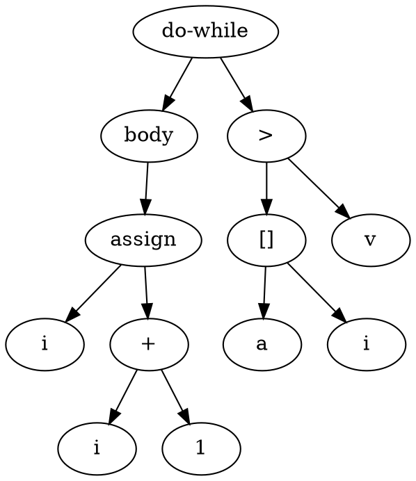
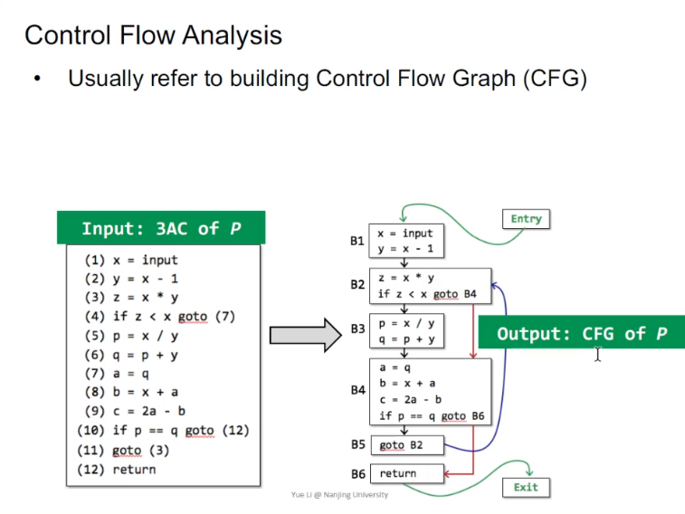
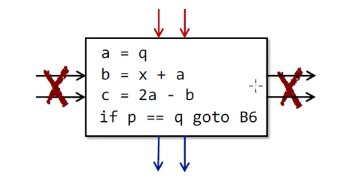
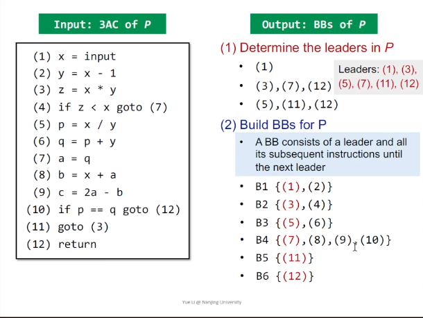
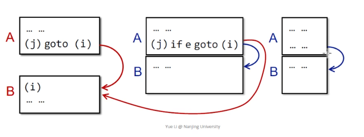
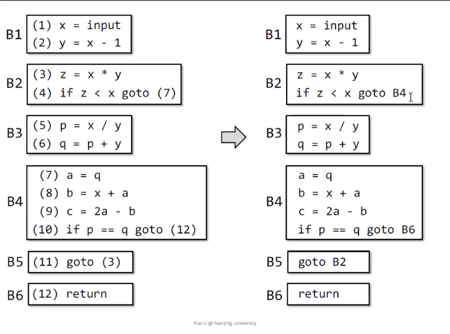
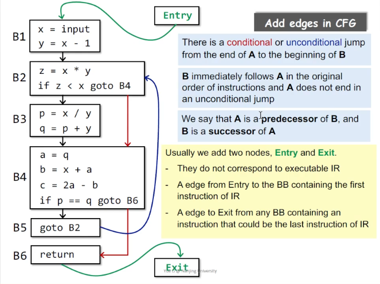

# Class-2. Intermediate Representation

Static analyzer expects to work on some clean and simple struct, and IR is designed to be used in this way.

There's no "best IR" in this world, so this chapater .

## Contents

1. Compilers and Static Analyzers
2. AST vs. IR
3. Three Address Code (3AC)
4. 3AC in real Static Analyzer
5. Static Single Assignment (SSA)
6. Basic Blocks (BB)
7. Control Flow Graphs (CFG)

## 1. Compilers and Static analyzers

Compiler: 
  - Source Code
  - `-->` Scanner (Lexical Analysis), get **Token Stream**
  - `-->` Parser (Syntax Analysis), get **Abstract Syntax Tree**
  - `-->` Type Checker (Semantic Analysis), get **Decorated AST**
  - `-->` Translator, get **Intermediate Representation**
  - **`-->` Optimizer (Static Analysis)**
  - `-->` Code Generator, get **Target Code**
  - `-->` Runtime

## 2. AST vs. IR

Why perform static analysis on IR, instead of AST?

Source Code:
```c
do {
    i = i + 1;
} while (a[i] < v);
```

AST:

- High level and closed to grammar structure
- Usually language dependent
- Suitable for fast type checking
- Lack of control flow information



IR: 

- Low level and closed to machine code
- **Usually language independent**
- Compact and uniform
- Contains control flow information
- **Usually considered as the basis for static analysis**

```tac
1: i = i + 1
2: t1 = a [ i ]
3: if t1 < v goto 1
```

## Three address Code (3AC)

There is no formal definition on Three address code. Here are some common properties:
- There is at most one operator on the right side of an 3AC instruction
- Each 3AC instruction contains at most 3 "addresses"
  - Address can be *names*, *constants* and *compiler generated temporaries*.
- Each operation has its own 3AC form

Some common 3AC forms
```tac
x = y bin-op z
x = u-op y
x = y
goto L
if x          goto L
if x rel-op y goto L
```

## Soot and Jimple: most popular static analysis framework for Java

Java source code:
```java
public class ForLoop3AC {
    public static void main(String[] args) {
        int x = 0;
        for (int i = 0; i < 10; i++) {
            x = x + 1;
        }
    }
}
```

Soot's IR Jimple: typed 3-address code

```jimple
public static void main(java.lang.String[])
{
    java.lang.String[] r0;
    int i1;

    // x was optimized away in the original video, manually added
    int i2;

    r0 := @parameter0: java.lang.String[];

    i1 := 0;
    i2 := 0;

label1:
    if i1 >= 10 goto label 2;
    i2 = i2 + 1;
    i1 = i1 + 1;
    goto label1;

label2:
    return;
}
```

Java:

```java
public class DoWhileLoop3AC {
    public static void main(String[] args) {
        int[] arr = new int[10];
        int i = 0;
        do {
            i = i + 1;
        } while (arr[i] < 10);
    }
}
```

Jimple:

```jimple
public static void main(java.lang.String[])
{
    java.lang.String[] r0;
    int[] r1;
    // $ is for generated temporaries
    int $i0, i1;

    r0 := @parameter0: java.lang.String[];
    r1 := newarray (int)[10];
    
label1:
    i1 = i1 + 1;
    $i0 = r1[i1];
    if $i0 < 10 goto label1;

    return;
}
```

Java:

```java
public class MethodCall3AC {
    String foo(String para1, String para2) {
        return para1 + " " + para2;
    }

    public static void main(String[] args) {
        MethodCall3AC mc = new MethodCall3AC();
        String result = mc.fopo("hello", "world");
    }
}
```

```jimple
java.lang.String foo(java.lang.String, java.lang.String)
{
    nju.sa.examples.MethodCall3AC r0; // for "this"
    java.lang.String r1, r2, $r7;
    java.lang.StringBuilder $r3, $r4, $r5, $r6; // for add operations, desugared

    r0 := @this: nju.sa.examples.MethodCall3AC;
    $r3 = new java.lang.StringBuilder;

    // invokespecial: call constructor, super methods and private methods
    // invokevirtual: instance methods call, virtual dispatch
    // invokeinterface: no optimize, perform checking interface implementation
    // invokestatic: call static method
    // invokedynamic(introduced in java7): used by dynamic languages running on JVM

    // method signature: class name: return type method-name (param list)

    specialinvoke $r3.<java.lang.StringBuilder: void <init>()>();
    $r4 = virtualinvoke $3.<java.lang.StringBuilder:
                            java.lang.StringBuilder append(java.lang.String)>(r1);
    $r5 = virtualinvoke $3.<java.lang.StringBuilder:
                            java.lang.StringBuilder append(java.lang.String)>(" ");
    $r6 = virtualinvoke $3.<java.lang.StringBuilder:
                            java.lang.StringBuilder append(java.lang.String)>(r2);
    $r7 = virtualinvoke $3.<java.lang.StringBuilder:
                            java.lang.String toString()>(r1);
    return $r7;
}

public static void main(java.lang.String[])
{
    java.lang.String[] r0;
    nju.sa.examples.MethodCall3AC $r3;

    r0 := @parameter0: java.lang.String[];
    
    $r3: new nju.sa.examples.MethodCall3AC;
    specialinvoke $r3.<nju.sa.examples.MethodCall3AC: void <init>()>();
    virtualinvoke $r3.<nju.sa.examples.MethodCall3AC:
                       java.lang.String foo(java.lang.String, java.lang.String)>
                  ("hello", "world");
    return;
}
```

```java
public class Class3AC {
    public static final double pi = 3.14;
    public static void main(String[] args) {}
}
```

```jimple
public class nju.sa.examples.Class3AC extends java.lang.Object
{
    public static final double pi;
    
    public void <init>()
    {
        nju.sa.examples.Class3AC r0;
        r0 := @this: nju.sa.examples.Class3AC;

        // invoke ctor of parent java.lang.Object
        specialinvoke r0.<java.lang.Object: void<init>()>();
        return;
    }

    public static void main(java.lang.String[]) {
        java.lang.String[] r0;
        r0 := @parameter0: java.lang.String[];
        return;
    }

    // called on class load, initializes static fields
    public static void <clinit>()
    {
        <nju.sa.examples.Class3AC: double pi> = 3.14;
        return;
    }
}
```

## Static Single Assignment (SSA) *[Optional]*

All assignments in SSA are to to variables with distinct names
  - Give each definition a fresh name
  - Propagate fresh name to subsequent uses
  - **Every variable has exactly one definition**
  - A special merge operator `phi` is introduced to select the values at merge nodes

SSA advantages:
  - Flow information is indirectly incorporated into the unique variable names
    - May help deliver some simpler analyzes
  - Define and use pairs are explicit
    - Enable more effect data facts storage and propagation
    - Some optimization tasks perform better on SSA

SSA disadvantages:
  - SSA may introduce too many `phi` nodes
  - May introduce inefficiency problem when translating to ASM

## Control Flow Analysis, Control Flow Graph (CFG) and Basic Block (BB)



Control flow analysis
  - Usually refer to building Control Flow Graph (CFG)
  - CFG serves as the basic structure for static analysis
  - The node in CFG can be individual 3-address instruction, or (usually) **Basic Block (BB)**

Basic blocks are maximal sequences of consecutive 3AC instructions with the properties that
  - can be entered only at the beginning, i.e., **the first insc in the block**
  - can be exited only at the end, i.e., **the last insc in the block**



Intuitive method for constucting basic blocks: 
  - target of jump should be entrance of BB
  - jump insc should be commence and end of BB



Intitive method for constructing CFG
  - The nodes of CFG are basic blocks
  - There's an edge from block A to block B, iff
    - there is an jump (either conditional or unconditional) from the end of A to the beginning of B
    - B immediately follows A in the original order of inscs, and A does not end in an unconditional jump
  - And, replace labels with basic blocks for jump inscs.
  - Usually we add two nodes *Entry* and *Exit* for some purpose (e.g. for multi-threading analysis)






