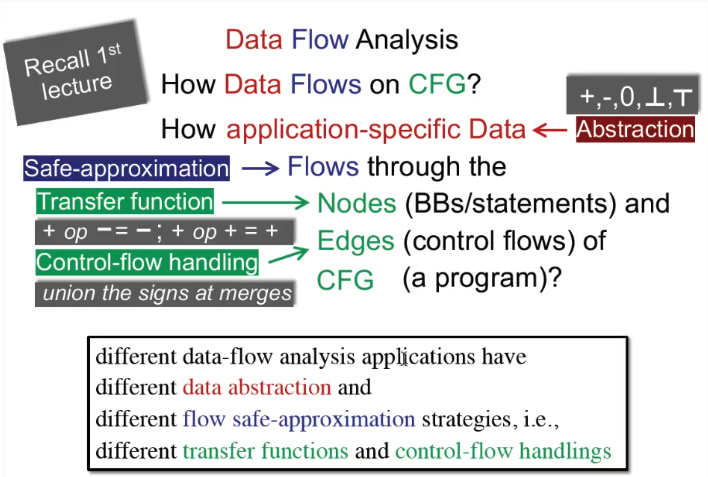
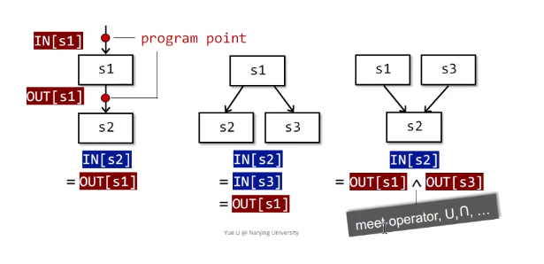
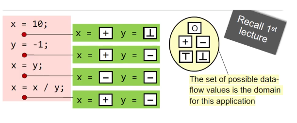
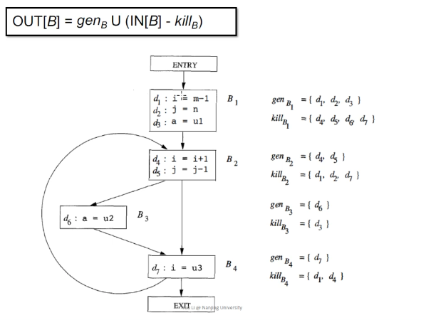
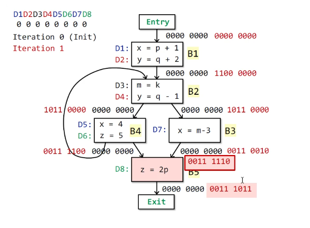
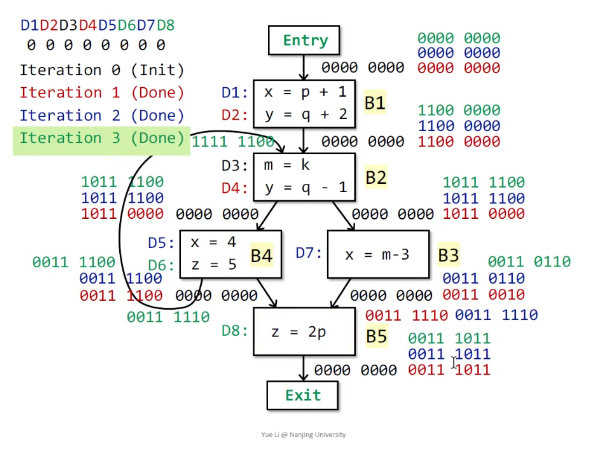

# Class-3. Data Flow Analysis - Applications

## Contents

1. Overview of Data Flow Analysis
2. Preliminaries of Data Flow Analysis
3. Reaching Definitions Analysis
> 4. Live Variables Analysis
> 5. Available Expressions Analysis
> 
> These two parts will be presented in next class

## 1. Data Flow Analysis: How **Data** **Flows** on **CFG**

How **Application-specific data** **Flows** through the **Nodes** and **Edges** of **CFG** (a program)?
  - Application-specific data `<-` abstraction
  - Flow `<-` safe-approximation (for most static analyzes / *may analysis*, over-approximation)
  - Nodes `<-` transfer function
  - Edges `<-` control-flow handling

### May analysis and Must analysis
  - **may analysis**: over approximation, output information **may** be true
  - **must analysis**: under approximation, output information **must** be true
Over- and under-approximation are both for **safety of analysis**



## 2. Preliminaries of Data Flow Analysis

### 2.1 Input and Output States

Each execution of an IR statement transforms an **input state** to a new **output state**. The input (output) state is associated with the **program point** before (after) the statement.



In each data-flow analysis application, we associate with every program point a **data-flow value** that represents an **abstraction** of the set of all possible **program states** that can be observed from that point.
 - **Data-flow value** is what we really concern in our static analysis application
 - The set of all possible data flow values is the **domain** for this application.



Data-flow analysis sis to find a solution to a set of **safe-approximation-directed constraints** on the IN[s]'s and OUT[s]'s, for all statements.
  - *constraints* based on semantics of statements (*transfer functions*)
  - *constraints* based on the *flows of control*

### 2.2 Notations for Transfer functions' Constraints
  - Forward analysis: OUT[s] = f<sub>s</sub>(IN[s])
  - Backward analysis: IN[s] = f<sub>s</sub>(OUT[s])

### 2.3 Notations for Control flows' Constraints
  - Control flow within a BB: In[s<sub>i+1</sub>] = OUT[s<sub>i</sub>], for all i = 1, 2, ..., n - 1
  - Control flow among BBs: IN[B] = IN[s<sub>1</sub>], OUT[B] = OUT[S<sub>n</sub>]
  - Forward analysis: OUT[B] = f<sub>B</sub>(IN[B]), f<sub>B</sub> = `Compose`(f<sub>s<sub>n</sub></sub>, f<sub>s<sub>n-1</sub></sub>, ..., f<sub>s<sub>1</sub></sub>); IN[B] = ∧<sub>P: predecessor of B</sub>OUT[P]
  - Backward analysis: IN[B] = f<sub>B</sub>(OUT[B]), f<sub>B</sub> = `Compose`(f<sub>s<sub>1</sub></sub>, f<sub>s<sub>2</sub></sub>, ..., f<sub>s<sub>n</sub></sub>); OUT[B] = ∧<sub>S: successor of B</sub>IN[S]

## 3. Reaching Definitions Analysis

> Issued not covered:
> - method calls (we analyze intra-procedural CFG only)
> - aliases (we assume variables don't have aliases)
>
> These topics are too difficult by this time

Reaching definitions: A **definition `d`** at program point `p` **reaches** a point `q` if there is a path from `p` to `q` such that `d` is not killed along that path
  - **A definition of a variable** is a statement that assigns to that variable
  - Translation: definiton of variable `v` at program point `p` reaches point `q`, if there is a path from `p` to `q`, such that *no new definition of `v` introduced*

Example of reaching definitions analysis: detect possible undefined variables. e.g., introduce a dummy definition of each variable `v` at the entry of CFG, and if the dummy definition of `v` reaches a point `p` where `v` is used, then `v` may be used before definition (*undefined reaches `v`*).

### 3.1 Understanding Reaching definitons
Abstraction: Data Flow Values/Facts
  - The definitions of all the variables in a program
  - Can be represented by bit vectors
Safe approximation: Transfer Functions and Control Flows
  - An assignment statement `D: v = x op y` "generates" a definition of `D` of variable `v` and "kills" all the other definitions in the program that define variable `v`, while leaving the remaining incoming definitions unaffected.
  - Transfer function: OUT[B] = *gen*<sub>B</sub> ∪ (IN[B] - *kill*<sub>B</sub>)
  - Control flow: IN[B] = ∪<sub>P: predecessor of B</sub>OUT[P]



### 3.2 Algorithm of Reaching Definition Analysis

**INPUT**: CFG (*kill*<sub>B</sub> and *gen*<sub>B</sub> computed for each basic block B)
**OUTPUT**: IN[B] and OUT[B] for each basic block B
**METHOD**:
```pseudo
    OUT[entry] = EMPTY;
    for B in (BBs - entry)
        OUT[B] = EMPTY;
    while changes to any OUT occur
        for each B in (BBs - entry)
            IN[B] = Union(P: predecessor of B, OUT[P])
            OUT[B] = Union(generate(B), (IN[B] - kill(B)))
```





Why this iterative algorithm can finally stop?
- `gen`<sub>s</sub> and `kill`<sub>s</sub> remain unchanged
- When more facts flow in IN[S], the "more facts" either
  - is killed, or
  - flows out to OUT[S] (survivor<sub>s</sub>)
- When a fact is added to OUT[S], through either gen<sub>s</sub> or survivor<sub>s</sub>, it stays there forever
- Thus OUT[S] never shrinks (e.g., `0->1, 1->1`)
- As the set of facts is finite, ther emust exist a pass of iteration during which nothing is added to any OUT, and then the algorithm terminates.


