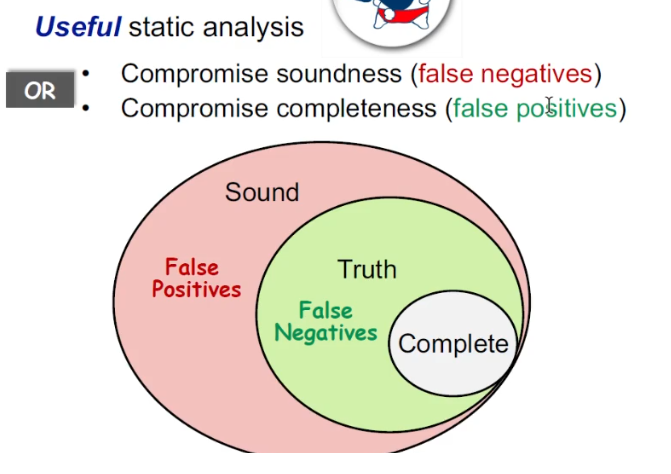

# Static program analysis

# Introduction

## Contents

1. What is PL and Static Analysis
2. What is and why Static Analysis
3. Static Analysis features and examples

## 1. PL, or Programming Languages, and Static analysis

PLT in Tri parts
1. Theory
  - Language design, Type system, Semantics and logics, ...
2. Environment
  - Compilers, Runtime system, ...
3. Application
  - Program analysis, Program verification, Program synthesis, ...

Development of programming languages
  - Imperative languages
  - Functional languages
  - Logic(Declarative) programming languages

The core of languages does not change, while the use of languages  (software development) becomes more and more complex.

Challange: How to ensure the reliability, security and other promises of large-scale and complex programs?

## 2. Static analysis: what and why

To gain
  - Program reliability: null pointer deref, memory leak, ...
  - Program security: private information leak, injection attack, ...
  - Compiler optimization: dead code elimination, code motion, ...
  - Program understanding: IDE call hierarchy, type indication, ...

Static analysis analyzes a program P to reason about its behaviors
and determines whether it satisfies some properties **before running** P.

### Rice's theorem, and perfect static analysis 

Unfortunately, by Rice's theorem, there's no such approach to determine whether P satisfies such non-trivial properties, i.e., giving exact answer. Any non-trivial property of the behavior of programs is in a r.e. language is undecidable.
  - r.e. (recursive enumerable) = recognizable by a Turing-machine
    - r.e = languages used by normal humanrance
  - A property is trivial if either it is not satisfied by any r.e. 
    language, or if it is satisfied by all r.e. languages; otherwise it is
    non-trivial.
    - A property is trivial if it is not interesting

Static analysis cannot be both **sound** and **complete**
  - Given Truth: For any input, the program can have certain properties.
    - For any input, one program have fixed 10 NPEs.
  - Sound: **overapproximate**
    - Include all the 10 NPEs, and can have false positives.
  - Complete: **underapproximate**
    - May not contain all the 10 NPEs, even having none of them, but all reports are correct.

Mostly compromising completeness: sound but not precise static analysis
  - Compromising soundness = not being sound = can have false negatives.
  - Compromising completeness = bot being complete = can have false positives.

### Necessity of soundness

Ensure (or get close to) soundness, while making good trade-offs between analysis precision and analysis speed.
- Soundness is critical to a collection of important static analysis applications such as compiler optimization and program verification.
- Soundness is also preferable to other (static-analysis) applications for which soundness is not demanded, e.g., bug detection, as better soundness implies more bugs could be found.

## 3. How do we go static analysis
- Abstract
- Over approximation
  - Transfer functions
  - Control flows

